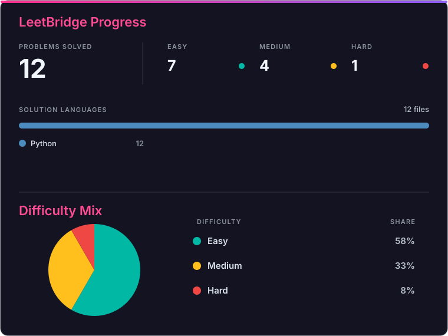
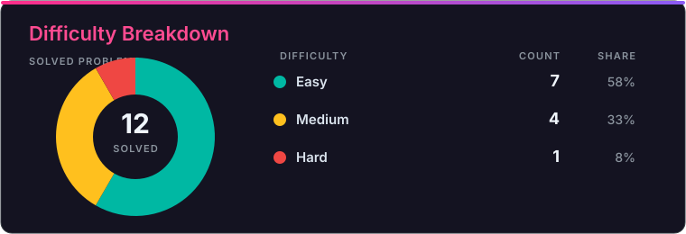

# LeetCode Solutions

A collection of accepted LeetCode solutions automatically synced by LeetBridge.

<!-- SOLUTIONS_START -->

## Progress

**12 problems solved**

  

  

<strong>View detailed statistics</strong>

| Total | 🟢 Easy | 🟡 Medium | 🔴 Hard |
| ---: | ---: | ---: | ---: |
| 12 | 7 | 4 | 1 |

| Language | Solutions |
| --- | ---: |
| Python | 12 |

## Solution Archive

| Problem | Difficulty | Solutions |
| --- | --- | --- |
| [0001 · Two Sum](https://leetcode.com/problems/two-sum/) | 🟢 **Easy** | [Python](0001-two-sum/solution.py) |
| [0002 · Add Two Numbers](https://leetcode.com/problems/add-two-numbers/) | 🟡 **Medium** | [Python](0002-add-two-numbers/solution.py) |
| [0003 · Longest Substring Without Repeating Characters](https://leetcode.com/problems/longest-substring-without-repeating-characters/) | 🟡 **Medium** | [Python](0003-longest-substring-without-repeating-characters/solution.py) |
| [0004 · Median of Two Sorted Arrays](https://leetcode.com/problems/median-of-two-sorted-arrays/) | 🔴 **Hard** | [Python](0004-median-of-two-sorted-arrays/solution.py) |
| [0020 · Valid Parentheses](https://leetcode.com/problems/valid-parentheses/) | 🟢 **Easy** | [Python](0020-valid-parentheses/solution.py) |
| [0151 · Reverse Words in a String](https://leetcode.com/problems/reverse-words-in-a-string/) | 🟡 **Medium** | [Python](0151-reverse-words-in-a-string/solution.py) |
| [0238 · Product of Array Except Self](https://leetcode.com/problems/product-of-array-except-self/) | 🟡 **Medium** | [Python](0238-product-of-array-except-self/solution.py) |
| [0345 · Reverse Vowels of a String](https://leetcode.com/problems/reverse-vowels-of-a-string/) | 🟢 **Easy** | [Python](0345-reverse-vowels-of-a-string/solution.py) |
| [0605 · Can Place Flowers](https://leetcode.com/problems/can-place-flowers/) | 🟢 **Easy** | [Python](0605-can-place-flowers/solution.py) |
| [1071 · Greatest Common Divisor of Strings](https://leetcode.com/problems/greatest-common-divisor-of-strings/) | 🟢 **Easy** | [Python](1071-greatest-common-divisor-of-strings/solution.py) |
| [1431 · Kids With the Greatest Number of Candies](https://leetcode.com/problems/kids-with-the-greatest-number-of-candies/) | 🟢 **Easy** | [Python](1431-kids-with-the-greatest-number-of-candies/solution.py) |
| [1768 · Merge Strings Alternately](https://leetcode.com/problems/merge-strings-alternately/) | 🟢 **Easy** | [Python](1768-merge-strings-alternately/solution.py) |

<!-- SOLUTIONS_END -->
