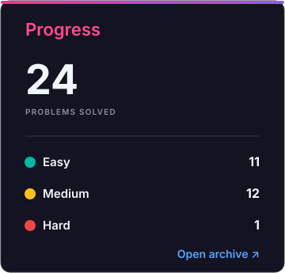
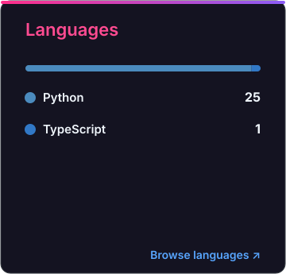
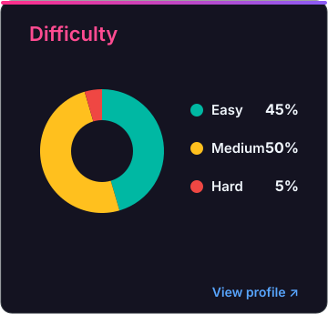

# LeetCode Solutions

A collection of accepted LeetCode solutions automatically synced by LeetBridge.

<!-- SOLUTIONS_START -->

  
  
  

<table width="100%">
<thead>
<tr><th align="left" colspan="3"><strong>Solution Archive</strong> 12 accepted problems synced by LeetBridge</th></tr>
<tr><th align="left">Problem</th><th align="left">Difficulty</th><th align="left">Solutions</th></tr>
</thead>
<tbody>
<tr><td><a href="https://leetcode.com/problems/two-sum/"><strong>0001 · Two Sum</strong></a></td><td>🟢 <strong>Easy</strong></td><td><a href="0001-two-sum/solution.py">Python</a></td></tr>
<tr><td><a href="https://leetcode.com/problems/add-two-numbers/"><strong>0002 · Add Two Numbers</strong></a></td><td>🟡 <strong>Medium</strong></td><td><a href="0002-add-two-numbers/solution.py">Python</a></td></tr>
<tr><td><a href="https://leetcode.com/problems/longest-substring-without-repeating-characters/"><strong>0003 · Longest Substring Without Repeating Characters</strong></a></td><td>🟡 <strong>Medium</strong></td><td><a href="0003-longest-substring-without-repeating-characters/solution.py">Python</a></td></tr>
<tr><td><a href="https://leetcode.com/problems/median-of-two-sorted-arrays/"><strong>0004 · Median of Two Sorted Arrays</strong></a></td><td>🔴 <strong>Hard</strong></td><td><a href="0004-median-of-two-sorted-arrays/solution.py">Python</a></td></tr>
<tr><td><a href="https://leetcode.com/problems/valid-parentheses/"><strong>0020 · Valid Parentheses</strong></a></td><td>🟢 <strong>Easy</strong></td><td><a href="0020-valid-parentheses/solution.py">Python</a></td></tr>
<tr><td><a href="https://leetcode.com/problems/reverse-words-in-a-string/"><strong>0151 · Reverse Words in a String</strong></a></td><td>🟡 <strong>Medium</strong></td><td><a href="0151-reverse-words-in-a-string/solution.py">Python</a></td></tr>
<tr><td><a href="https://leetcode.com/problems/product-of-array-except-self/"><strong>0238 · Product of Array Except Self</strong></a></td><td>🟡 <strong>Medium</strong></td><td><a href="0238-product-of-array-except-self/solution.py">Python</a></td></tr>
<tr><td><a href="https://leetcode.com/problems/reverse-vowels-of-a-string/"><strong>0345 · Reverse Vowels of a String</strong></a></td><td>🟢 <strong>Easy</strong></td><td><a href="0345-reverse-vowels-of-a-string/solution.py">Python</a></td></tr>
<tr><td><a href="https://leetcode.com/problems/can-place-flowers/"><strong>0605 · Can Place Flowers</strong></a></td><td>🟢 <strong>Easy</strong></td><td><a href="0605-can-place-flowers/solution.py">Python</a></td></tr>
<tr><td><a href="https://leetcode.com/problems/greatest-common-divisor-of-strings/"><strong>1071 · Greatest Common Divisor of Strings</strong></a></td><td>🟢 <strong>Easy</strong></td><td><a href="1071-greatest-common-divisor-of-strings/solution.py">Python</a></td></tr>
<tr><td><a href="https://leetcode.com/problems/kids-with-the-greatest-number-of-candies/"><strong>1431 · Kids With the Greatest Number of Candies</strong></a></td><td>🟢 <strong>Easy</strong></td><td><a href="1431-kids-with-the-greatest-number-of-candies/solution.py">Python</a></td></tr>
<tr><td><a href="https://leetcode.com/problems/merge-strings-alternately/"><strong>1768 · Merge Strings Alternately</strong></a></td><td>🟢 <strong>Easy</strong></td><td><a href="1768-merge-strings-alternately/solution.py">Python</a></td></tr>
</tbody>
</table>

<!-- SOLUTIONS_END -->
